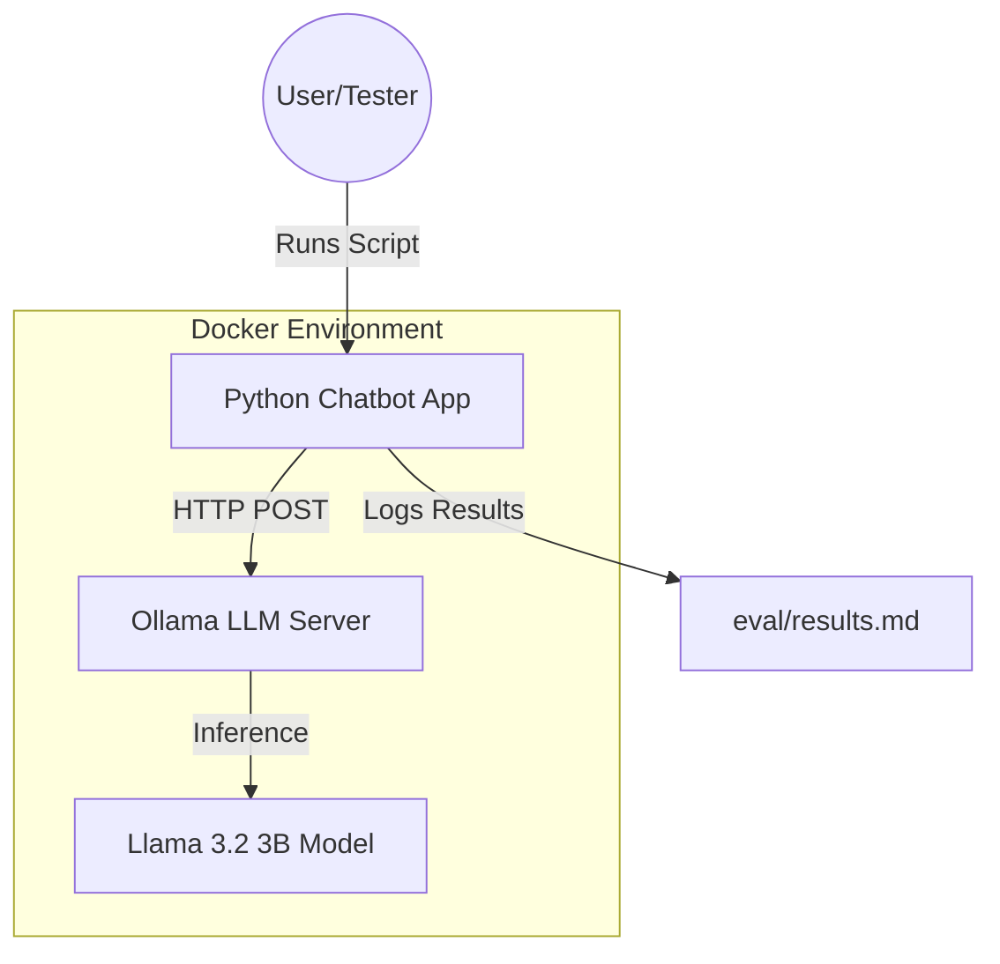

# Offline Customer Support Chatbot with Ollama & Llama 3.2

[](docker-compose.yml)
[](https://ollama.com/)

A functional, completely offline customer support chatbot for e-commerce, leveraging local Large Language Models (LLMs) to ensure data privacy and zero API costs.

---

## 🏗️ System Architecture

The project follows a local-first, containerized architecture where the chatbot application and the LLM engine run in separate, networked containers.



### Components:
1.  **Python Chatbot (`chatbot.py`)**: The orchestration layer that manages prompts, handles API communication, and logs evaluation results.
2.  **Ollama Server**: An open-source inference engine running Meta's **Llama 3.2 (3B)** model locally.
3.  **Prompt Templates**: Pre-defined `Zero-Shot` and `One-Shot` strategies to guide model behavior.

---

## 🚀 Getting Started

### Prerequisites
- [Docker](https://www.docker.com/) and [Docker Compose](https://docs.docker.com/compose/) installed.
- (Optional) [Ollama](https://ollama.com/) installed locally if running without Docker.

### Option 1: Running with Docker (Recommended)
This method starts both the Ollama server and the Chatbot app automatically.

1.  **Clone the Repository**:
    ```bash
    git clone <repo-url>
    cd <repo-name>
    ```

2.  **Launch the System**:
    ```bash
    docker-compose up --build
    ```
    *Note: The first run will download the Ollama image and the Llama 3.2 model inside the container.*

### Option 2: Local Installation (Manual)
1.  **Install Requirements**:
    ```bash
    pip install -r requirements.txt
    ```
2.  **Run Ollama Locally**:
    Ensure Ollama is running and the model is available:
    ```bash
    ollama pull llama3.2:3b
    ```
3.  **Execute the Chatbot**:
    ```bash
    python chatbot.py
    ```

---

## 📊 Evaluation & Methodology

The project uses a dataset adapted from the **Ubuntu Dialogue Corpus**, converted into 20 realistic e-commerce scenarios.

### Prompting Strategies:
| Strategy | Description |
| :--- | :--- |
| **Zero-Shot** | Direct instruction without examples. High reliance on model's internal pre-training. |
| **One-Shot** | Includes a high-quality example of the desired response format and tone. |

### Evaluation Results:
Detailed logs of all interactions and performance scores can be found in:
👉 **[eval/results.md](eval/results.md)**

---

## 📂 Project Structure
```text
├── prompts/              # LLM Prompt Templates
│   ├── zero_shot_template.txt
│   └── one_shot_template.txt
├── eval/                 # Evaluation Results and Logs
│   └── results.md
├── chatbot.py            # Main application logic
├── fetch_data.py         # Data preparation script
├── Dockerfile            # Container definition
└── docker-compose.yml    # Service orchestration
```

---

## 📜 Findings Summary
Using **One-Shot prompting** significantly improved the model's ability to provide professional, actionable responses (e.g., including placeholder contact details and structured steps) compared to generic Zero-Shot outputs.

Detailed analysis is available in **[report.md](report.md)**.
